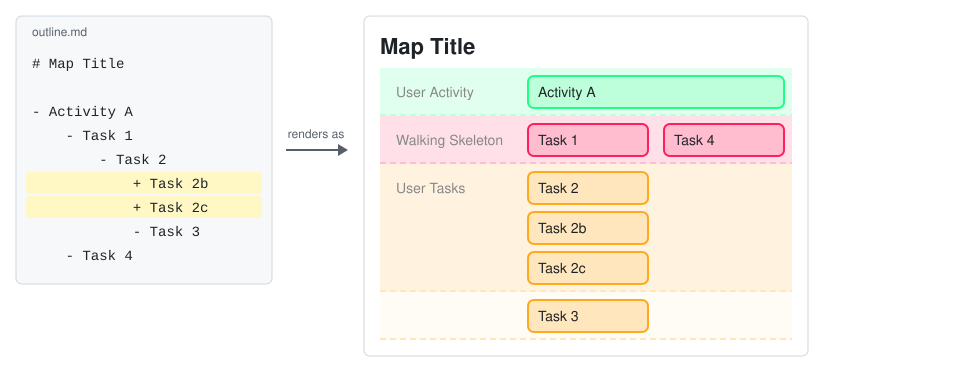
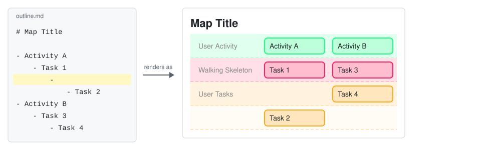

# VSCode用 User Story Mapping 拡張機能

English version: [README.md](README.md)

[User Story Mapping](https://jpattonassociates.com/story-mapping/) は Jeff Patton が提唱した手法で、プロダクト全体をユーザーの視点で見渡し、何から作るべきかを決めるためのものです。ユーザーの活動の流れに沿ってストーリーを左から右へ並べ、早く手を付ける必要のあるストーリーほど上に置きます。

この拡張機能を使うと、この手法を Markdown のアウトラインだけで実践できます。箇条書きで書いたアウトラインを、ユーザーストーリーマップとしてプレビュー表示します。専用の作図ツールでカードを1枚ずつ並べる必要はなく、書き慣れたアウトラインだけでマップが完成します。

## 使い方

1. ストーリーマップにしたい Markdown ファイル（.md）を開きます。
2. 次のどちらかの方法でプレビューを開きます。
   - エディタ右上の地図アイコン「Preview as User Story Map」を押します。
   - エディタ内で右クリックし、メニューから「Preview as User Story Map」を選びます。
3. プレビューがエディタの横に表示されます。

### アウトラインの書式

基本の考え方は2つです。

- 時系列は左から右: ユーザーの大きな活動（アクティビティ）を、行動の流れの順に箇条書きします。マップでは横一列に並びます。
- 優先順位はネストの深さ: アクティビティの下にユーザータスクをぶら下げ、早く手を付ける必要のあるタスクほど浅く、後でよいタスクほど深くネストします。マップでは浅いタスクほど上の行に置かれます。

たとえば、次のアウトラインを書くと、

```markdown
# Map Title

- Activity A
	- Task 1
		- Task 2
			- Task 3
	- Task 4
- Activity B
	- Task 5
```

このようなマップが描かれます。


#### 文法の一覧

以下の一覧では、次の例を参照します。

```markdown
# マップのタイトル

- アクティビティA
	- [ ] タスク1
		+ タスク1b
		- [x] タスク2
	- タスク3
- アクティビティB
	- 
		- タスク4
```

| 書き方 | マップでの表示 |
|---|---|
| 最初の見出し（`#`〜） | マップ冒頭のタイトル。なければ空のタイトル領域 |
| トップレベルの `- ` | アクティビティ。1行目（User Activity、緑の帯）に横一列に並ぶ |
| ネスト1段の `- ` | 最初に手を付けるタスク。2行目（Walking Skeleton、赤の帯）に並ぶ |
| ネスト2段以降の `- ` | タスク。3行目以降（User Tasks、黄の帯）に、深さ＝行として並ぶ |
| 同じ深さの `- ` を連続 | 2つ目以降は右どなりの内部カラムへ分かれる（例のタスク3） |
| 内容のない `- ` だけの行 | 空白レベル。カードは作られず、レベルだけ1つ深くなる（例のタスク4はレベル2から始まる） |
| `+ ` のアイテム | 1つ上のレベル、つまり親タスクと同じセルに縦に積まれる（例のタスク1bはタスク1の下に付く） |
| `[ ] ` で始まるアイテム | 未完了タスク。⬜と影付きのカード |
| `[x] ` / `[X] ` で始まるアイテム | 完了タスク。✅と枠なし・影なしのカード |
| チェックボックスなし | 枠のみのカード |

インデントについての補足です。

- インデントはタブでもスペースでもかまいません。Markdown（CommonMark）の解釈に従い、タブ1個はスペース4個に相当します。
- 1つのファイル内では、インデントの流儀を統一することを推奨します。

一覧の中でも読み違えやすい2つの書き方、「`+` でカードを積む」と「空白レベル」を、次の2つの節で図とともに説明します。

#### `+` でカードを積む

`+ ` のアイテムは、1つ上のレベルにある親タスクと同じセルに縦に積まれます。関係の深いカードをひとまとめにしたいときに使います。同じ深さの `- ` のアイテムは、積まれずに次の行へ置かれます。

```markdown
# Map Title

- Activity A
	- Task 1
		+ Task 1b
		+ Task 1c
		- Task 2
	- Task 3
```

このようなマップが描かれます。



#### 空白レベル

内容のない `- ` だけの行は、カードを作りません。レベルだけを1つ深くします。後でよいタスクを下の行へ押し下げたいときに使います。例では、空白レベルが上にある Task 2 が、Task 4 より1行下に置かれます。

```markdown
# Map Title

- Activity A
	- Task 1
		- 
			- Task 2
- Activity B
	- Task 3
		- Task 4
```

このようなマップが描かれます。



## おすすめの設定

快適にアウトラインを編集するために、次の設定をおすすめします。

- 拡張機能「[Markdown All in One](https://marketplace.visualstudio.com/items?itemName=yzhang.markdown-all-in-one)」をインストールします。
- キーバインディングをアウトライナー風に変更します（項目の入れ替え、インデント操作など）。

## 動作環境

- VSCode デスクトップ版（Windows/macOS/Linux）で動作します。
- Web 版（vscode.dev）には対応していません。

## インストール

当面は GitHub のリリースページから `.vsix` ファイルをダウンロードし、手動でインストールしてください。安定したら、VSCode Marketplace への公開を目指します。

## 開発

```powershell
npm install
```

- **実行**: VSCode でこのフォルダを開き、F5 で拡張機能開発ホストを起動します。
- **watch ビルド**: `npm run watch`
- **テスト**: `npm test`（Mocha + `@vscode/test-cli`。テスト用の VSCode が起動します）
- **パッケージング**: `npm run package` で本番ビルドを生成します。

### ドキュメント

- `docs/storymap.md` — 本プロダクト自身のストーリーマップ（拡張機能が完成するまでの暫定運用）
- `docs/adr/` — アーキテクチャ上の決定の記録（ADR）
- `docs/plans.md` — 現在 TDD の対象としている作業用 todo
- `test/test.md` — 動作確認用のテストマップ
