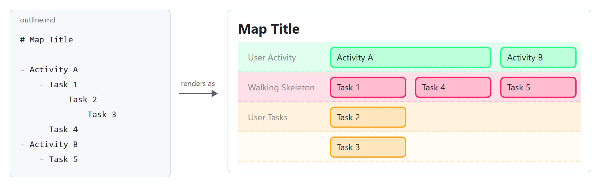
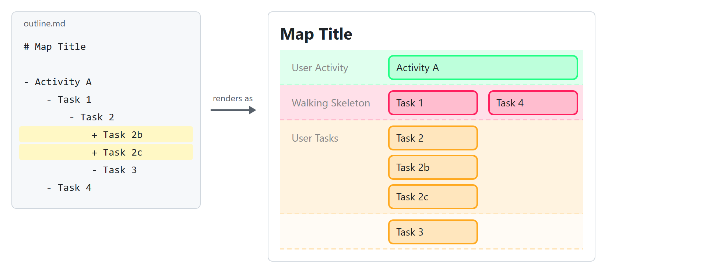
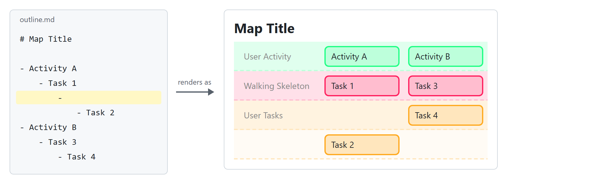

# VSCode用 User Story Mapping 拡張機能

English version: [README.md](README.md)

[User Story Mapping](https://jpattonassociates.com/story-mapping/) は Jeff Patton が提唱した手法で、プロダクト全体をユーザーの視点で見渡し、何から作るべきかを決めるためのものです。ユーザーの活動の流れに沿ってストーリーを左から右へ並べ、早く手を付ける必要のあるストーリーほど上に置きます。

この拡張機能を使うと、この手法を Markdown のアウトラインだけで実践できます。箇条書きで書いたアウトラインを、ユーザーストーリーマップとしてプレビュー表示します。専用の作図ツールでカードを1枚ずつ並べる必要はなく、書き慣れたアウトラインだけでマップが完成します。

## 使い方

1. ストーリーマップにしたい Markdown ファイル（.md）を開きます。
2. 次のどちらかの方法でプレビューを開きます。
   - エディタ右上の地図アイコン「Preview as User Story Map」を押します。
   - エディタ内で右クリックし、メニューから「Preview as User Story Map」を選びます。
3. プレビューがエディタの横に表示されます。

### アウトラインの書式

基本の考え方は2つです。

- 時系列は左から右: ユーザーの大きな活動（アクティビティ）を、行動の流れの順に箇条書きします。マップでは横一列に並びます。アクティビティに含まれるユーザータスクも同じで、同じ深さのタスクは書いた順に左から右へ置かれます。
- 優先順位はネストの深さ: アクティビティの下にユーザータスクをぶら下げ、早く手を付ける必要のあるタスクほど浅く、後でよいタスクほど深くネストします。マップでは浅いタスクほど上の行に置かれます。

たとえば、次のアウトラインを書くと、

```markdown
# Map Title

- Activity A
	- Task 1
		- Task 2
			- Task 3
	- Task 4
- Activity B
	- Task 5
```

このようなマップが描かれます。



#### 文法の一覧

以下の一覧では、次の例を参照します。

```markdown
# マップのタイトル

このマップは最初のリリースの範囲を示す。

- アクティビティA
	- [ ] タスク1+
		- タスク1b
	- [x] タスク2
		- タスク3
- アクティビティB
	- 
		- タスク4
```

| 書き方 | マップでの表示 |
|---|---|
| 最初の見出し（`#`〜） | マップ冒頭のタイトル。なければ空のタイトル領域 |
| 最初の箇条書きより上のパラグラフ | タイトルの下の補足事項。マップについての説明に使う |
| トップレベルの `- ` | アクティビティ。1行目（User Activity、緑の帯）に横一列に並ぶ |
| ネスト1段の `- ` | 最初に手を付けるタスク。2つ目の帯（Walking Skeleton、赤）に並ぶ |
| ネスト2段以降の `- ` | タスク。3つ目以降の帯（User Tasks、黄）に並ぶ。ネストが1段深くなるごとに帯が1つ下がる |
| 同じ深さの `- ` を連続 | 2つ目以降は右どなりの内部カラムへ分かれる（例のタスク2） |
| 内容のない `- ` だけの行 | 空白レベル。カードは作られず、レベルだけ1つ深くなる（例のタスク4はレベル2から始まる） |
| 行末が `+` のアイテム | その子は帯を下がらず、同じ帯の1つ下の行に置かれる（例のタスク1bは赤の帯のまま、タスク1の下に付く）。`+` はカードには表示されない |
| `[ ] ` で始まるアイテム | 未完了タスク。⬜と影付きのカード |
| `[x] ` / `[X] ` で始まるアイテム | 完了タスク。✅と枠なし・影なしのカード |
| チェックボックスなし | 枠のみのカード |

インデントについての補足です。

- インデントはタブでもスペースでもかまいません。Markdown（CommonMark）の解釈に従い、タブ1個はスペース4個に相当します。
- 1つのファイル内では、インデントの流儀を統一することを推奨します。

一覧の中でも読み違えやすい2つの書き方、「`+` で子を同じ帯に置く」と「空白レベル」を、次の2つの節で図とともに説明します。

#### `+` で子を同じ帯に置く

通常は、ネストが1段深くなるごとにタスクは1つ下の帯に移ります。行末に `+` を付けたアイテムの子は、帯を下がらず、そのアイテムと同じ帯に置かれます。位置は、同じ帯の中でそのアイテムの1つ下の行です。子が複数あれば、左から右へ横に並びます。優先度が同じタスクを1つの親の下にまとめて書きたいときに使います。

```markdown
# Map Title

- Activity A
	- Task 1 +
		- Task 1b
		- Task 1c
	- Task 2
- Activity B
	- Task 3
```

このようなマップが描かれます。



Task 1b と Task 1c は、赤の Walking Skeleton の帯の中で、Task 1 の1つ下の行に置かれます。帯の高さはすべてのカラムで2行に広がるので、Activity B の Task 3 は帯の1行目に置かれたままです。

同じルールはアクティビティにも使えます。行末に `+` を付けたアクティビティの子は、緑の帯の中のサブアクティビティになり、それぞれが自分のカラムを持ちます。

```markdown
- Activity A +
	- Activity A1
		- Task 1
	- Activity A2
		- Task 2
```

#### 空白レベル

内容のない `- ` だけの行は、カードを作りません。レベルだけを1つ深くします。後でよいタスクを下の行へ押し下げたいときに使います。例では、空白レベルが上にある Task 2 が、Task 4 より1行下に置かれます。

```markdown
# Map Title

- Activity A
	- Task 1
		- 
			- Task 2
- Activity B
	- Task 3
		- Task 4
```

このようなマップが描かれます。



## おすすめの設定

快適にアウトラインを編集するために、次の設定をおすすめします。

- 拡張機能「[Markdown All in One](https://marketplace.visualstudio.com/items?itemName=yzhang.markdown-all-in-one)」をインストールします。
- キーバインディングをアウトライナー風に変更します（項目の入れ替え、インデント操作など）。

## 動作環境

- VSCode デスクトップ版（Windows/macOS/Linux）で動作します。
- Web 版（vscode.dev）には対応していません。

## インストール

VSCode の拡張機能ビューで「User Story Mapping」を検索し、VSCode Marketplace からインストールしてください。

GitHub のリリースページから `.vsix` ファイルをダウンロードして、手動でインストールすることもできます。

## 開発

```powershell
npm install
```

- **実行**: VSCode でこのフォルダを開き、F5 で拡張機能開発ホストを起動します。
- **watch ビルド**: `npm run watch`
- **テスト**: `npm test`（Mocha + `@vscode/test-cli`。テスト用の VSCode が起動します）
- **パッケージング**: `npm run package` で本番ビルドを生成します。

### ドキュメント

- `docs/storymap.md` — 本プロダクト自身のストーリーマップ（拡張機能が完成するまでの暫定運用）
- `docs/adr/` — アーキテクチャ上の決定の記録（ADR）
- `docs/plans.md` — 現在 TDD の対象としている作業用 todo
- `test/test.md` — 動作確認用のテストマップ
