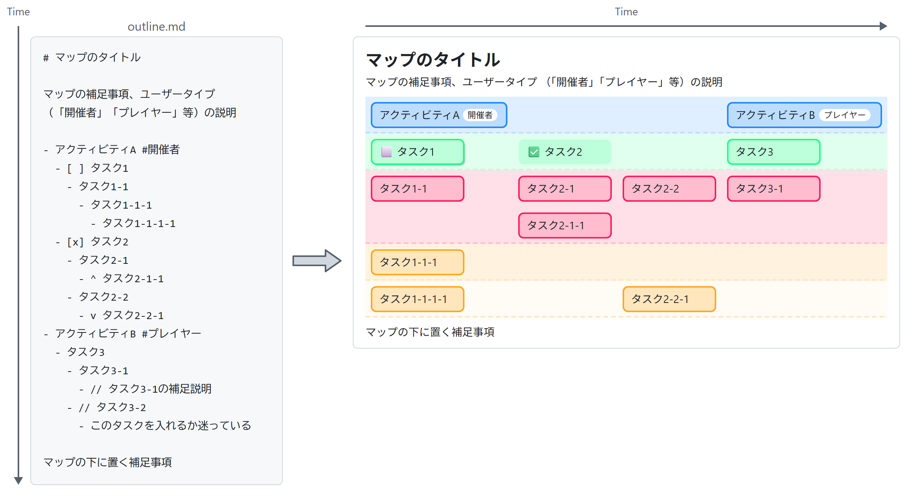
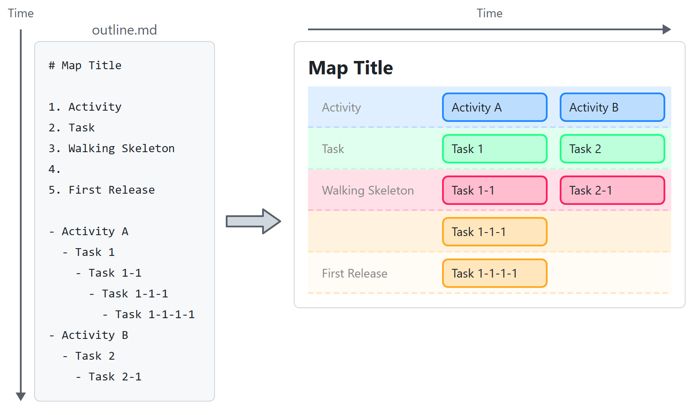
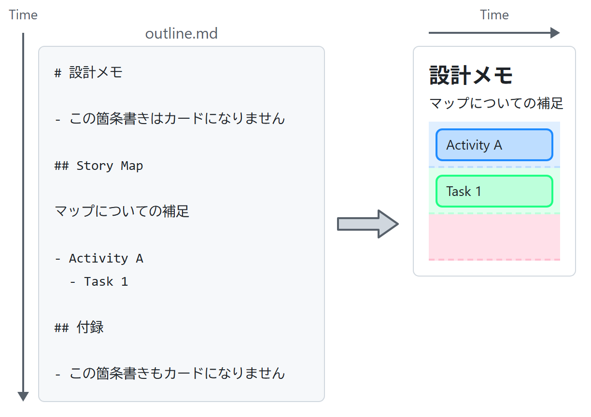

[README (English)](README.md)

# VSCode用ストーリーマッピング拡張機能

## ストーリーマッピングとは

[ストーリーマッピング](https://jpattonassociates.com/story-mapping/)は、製品の機能とその必要性に関する議論を簡単にする手法です。この拡張機能は、Markdownのリスト（箇条書き）を用いて、ストーリーマッピングを作図します。

ストーリーマッピングでは、ユーザーが製品を利用する流れに沿ってタスクを左から右へ並べ、必要性の高い下位タスクを上から下に並べることによって二次元のマップを作ります。このマップは、ユーザーと開発者が製品の全体像をつかんで、どこから開発を始め、いつ何をリリースするべきかを検討する助けとなります。

## 個人のストーリーマッピング

本来のストーリーマッピングは、チームが付箋紙やカードを囲んで会話を重ね、共通理解を築いてゆきます。しかし私は、個人がデジタルツールで取り組む場合にもこの手法の役立つ部分があると考えています。

本拡張機能は、ストーリーマッピングをMarkdownのリスト (bullet list) だけで実践できるようにするものです。箇条書きで書いたアウトライン（親子関係を持つリスト項目）を、そのまま二次元のマップとしてプレビュー表示できます。

チームでのストーリーマッピングは、カードをきっかけとする会話が中心です。個人でのストーリーマッピングは、[Workflowy](https://workflowy.com/ja/)を用いて思考整理するように、アウトラインを見つめ、組み替えるなかで、自らへ問いかける実践となります。

このツールは、主に個人が製品についての考えを深めるために使います。また、チームで付箋紙を使って作ったストーリーマップを、デジタル編集可能なスナップショットとして残す用途にも向いているかもしれません。

## 使い方

1. ストーリーマップにしたい Markdown ファイル（.md）を開きます。
2. 「[ストーリーマップのアウトライン書式](#ストーリーマップのアウトライン書式)」に従って、リストを書きます。
   - ユーザーが製品を利用するときに行うことを、大きなステップに分けて、リスト項目として書き出します。
     - この項目は「タスク」と呼びます。タスクは「〇〇する」の形で終わる文章とします。
   - 次に、各タスクを親とする下位タスクを子項目として追加します。

   - 手順の詳細は [Jeff Pattonの記事](https://jpattonassociates.com/the-new-backlog/)や[書籍「ユーザーストーリーマッピング」](https://www.oreilly.co.jp/books/9784873117324/)を参照してください。
3. 次のどちらかの方法でプレビューを開きます。
   - エディター右上の地図アイコン「Preview as Story Map」を押します。
   - エディター内で右クリックし、メニューから「Preview as Story Map」を選びます。
4. マップがエディターの横に表示されます。

## ストーリーマップのアウトライン書式

基本の考え方は2つです。

- **時系列**
  - ストーリーマップでは、タスクの時系列をマップ上の水平方向（左から右）で表現します。
  - アウトライン上では、タスクの時系列を同じインデントレベルの項目の並び順で表現します。
- **抽象度と必要性**
  - ストーリーマッピングでは、タスクの抽象度と必要性をマップ上の垂直方向（上から下）で表現します。
    - 複数のタスクを抽象化（グループ化）した「アクティビティ」を最上段に置いて、二段目にタスクを置きます。
    - 三段目以降は下位タスクで、必要性の高いものほど上に置きます。
  - アウトライン上では、タスクの抽象度と必要性をインデントの深さで表現します。

例として、このドキュメント冒頭の図を確認してください。左がアウトライン、右がそれをストーリーマップとしてプレビュー表示したものです。

### 文法一覧

以下の文法解説では、次の例を参照します。

| 書き方 | マップでの表示 |
| --- | --- |
| `# `最初の見出し | マップ冒頭のタイトル。なければ空のタイトル領域。 |
| 最初のリストより上のパラグラフ | タイトルの下に置かれる補足事項。マップについての説明や、登場するユーザータイプの説明に使う。 |
| リストより下のパラグラフ | マップの下に置かれる補足事項。マップ全体についてのメモや、決めかねていることなどに使う。 |
| `- `（リスト項目） | インデントが深いほど、マップ上では下段に置かれる。 |
| 同じ深さの `- ` を連続 | 2つ目以降は右どなりの内部カラムへ分かれる（例のタスク2）。 |
| `^ ` で始まるアイテム | 上のスライスへ移動。親と同じスライスの、1つ下の行に置かれる（例のタスク2-1-1は、タスク2-1と同じ赤のスライスに入る。タスク2-1-1-1にも `^ ` が付いているので、同じく赤のスライスに入る）。`^` はカードには表示されない。 |
| `v ` で始まるアイテム | 下のスライスへ移動。`v` 1つにつきスライス1つ分、下へ移動する（例のタスク2-2-1は、黄色のスライスを1つ飛ばしてその下のスライスに入る）。`vv ` なら2スライスあける。`v` はカードには表示されない。 |
| `//` で始まるアイテム | メモ。カードにまつわる背景や考えたことを書く。子のアイテムごとマップからは完全に無視され、カラムや行の数にも影響しない。 |
| `- [ ] ` で始まるアイテム | 未完了タスク。⬜と影付きのカード。 |
| `- [x] `または`- [X] ` で始まるアイテム | 完了タスク。✅と枠なし・影なしのカード。 |
| 行末の `#タグ`（複数可） | カードの末尾に白い角丸のタグとして表示される。`#` は表示されない。 |
| `1. `順序つきリスト | スライスにラベルを追加します。[スライスのラベル](#スライスのラベル)参照。 |

### 文法詳細

#### インデント

- インデントはタブでもスペースでもかまいません。Markdown（CommonMark）の解釈に従い、タブ1個はスペース4個に相当します。
- 1つのファイル内では、インデントの流儀を統一することを推奨します。

#### スライスのラベル

マップを水平線で切り分けたまとまりをスライスと呼びます。ストーリーマッピングでは通常、最上段のスライスをアクティビティ、上から2段目をタスク、上から3段目をウォーキングスケルトンと呼びます。4段目以降には、個別のゴール名を付けます。

ただし、あなたの作りたいマップによって、これは異なるかもしれません。次の方法で自由に名前をつけて、ラベルを表示させることができます。

`1.` で始まる順序付きリストで、スライスの名前を上から順に書いてゆきます。ラベルはマップの左端に表示されます。ラベルを付けないスライスは、`4.` のように番号だけの空の項目にしてください。

#### `^` でタスクを上のスライスに移動する

通常は、インデントが1段深くなるごとにタスクは1つ下のスライスに移ります。本文の先頭に `^ ` を付けたアイテムは、1つ上の親と同じスライスに置かれます。スライス内の位置は、親の1つ下の行です。

Task 1-1-1 と Task 1-1-2 は、赤のスライスの中で、Task 1-1 の1つ下の行に置かれます。スライスの高さはすべてのカラムで2行に広がるので、Activity B の Task 2-1 はスライスの1行目に置かれたままです。

ToDo記法を含む場合、`- [ ] ^ `のように本文の先頭に`^ `を置いてください。

#### `v` でタスクを下のスライスに移動する

本文の先頭に `v ` を付けたアイテムは、親の1つ下ではなく、2つ下のスライスに置かれます。`v` の数が、あけるスライスの数です。`vv ` なら2つあけて、親の3つ下に置かれます。

Task 1-1-1 は、黄のスライスを飛ばしてその下のスライスに置かれます。`vv ` を付けた Task 2-1-1 は、2つ飛ばします。飛ばしたスライスも描画されます。

### 通常の Markdown 文書の中にストーリーマップを書く

発展的な使い方です。文書の中に `Story Map` という見出しを置くと、その見出しから次の見出しまでの範囲だけがストーリーマップとして扱われます。見出しより前の箇条書きや、次の見出しより後の箇条書きはカードになりません。設計メモや議事録の一部としてストーリーマップを書きたいときに使います。

- 見出しのレベルは問いません。`## Story Map` でも `### Story Map` でもよいです。
- 見出しの文字は `Story Map` だけにします。大文字と小文字は区別しません（`story map`、`STORY MAP` も一致します）。`My Story Map` のように他の語を含む見出しは一致しません。
- マップのタイトルは、`Story Map` の見出しではなく、文書の最初の見出しです。PNG のファイル名にも同じタイトルが使われます。
- 補足のパラグラフとレベル名の順序付きリストも、`Story Map` の見出しより後に書いたものだけが使われます。
- `Story Map` の見出しがなければ、これまでどおり文書全体がストーリーマップとして扱われます。

## おすすめの設定

快適にアウトラインを編集するために、次の設定をおすすめします。

- VSCode拡張機能「[Dynalist-Style Moves](https://marketplace.visualstudio.com/items?itemName=OneOffObject.dynalist-mover-vscode)」
  - 項目の上下移動がツリー単位でできるようになります。
- VSCode拡張機能「[Markdown All in One](https://marketplace.visualstudio.com/items?itemName=yzhang.markdown-all-in-one)」
  - 一般的なMarkdownの便利機能です。
- VSCode拡張機能「[markdownlint](https://marketplace.visualstudio.com/items?itemName=DavidAnson.vscode-markdownlint)」
  - Markdown用の文法チェッカーです。
- あとはキーバインディングをお気に入りのアウトライナー風に変更してください（項目の入れ替え、インデント操作など）。

## 動作環境

- VSCode デスクトップ版（Windows/macOS/Linux）で動作します。
- Web 版（vscode.dev）には対応していません。

## インストール

VSCode の拡張機能ビューで「Story Mapping」を検索し、VSCode Marketplace からインストールしてください。

GitHub のリリースページから `.vsix` ファイルをダウンロードして、手動でインストールすることもできます。
