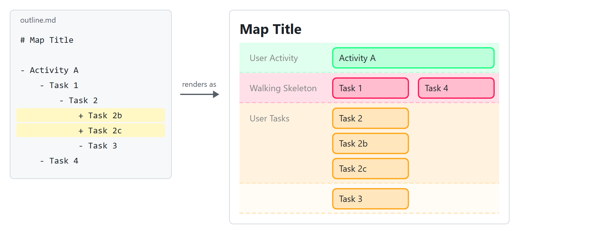
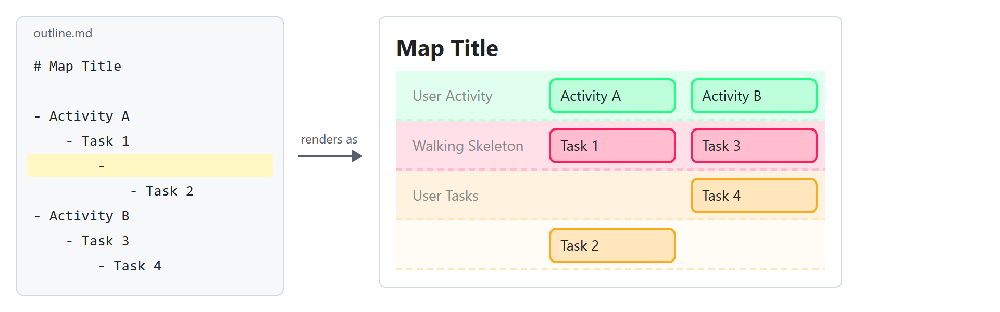

[README (English)](README.md)

# VSCode用ストーリーマッピング拡張機能


## ストーリーマッピングとは

[ストーリーマッピング](https://jpattonassociates.com/story-mapping/)は、製品の機能とその必要性に関する議論を簡単にする手法です。この拡張機能は、Markdownのリスト（箇条書き）を用いて、ストーリーマッピングを作図します。

ストーリーマッピングでは、ユーザーが製品を利用する流れに沿ってタスクを左から右へ並べ、必要性の高いサブタスクを上から下に並べることによって二次元のマップを作ります。このマップは、ユーザーと開発者が製品の全体像をつかんで、どこから開発を始め、いつ何をリリースするべきかを検討する助けとなります。

## 個人のストーリーマッピング

本来のストーリーマッピングは、チームが付箋紙やカードを囲んで会話を重ね、共通理解を築いてゆきます。しかし私は、個人がデジタルツールで取り組む場合にもこの手法の役立つ部分があると考えています。

本拡張機能は、ストーリーマッピングをMarkdownのリスト (bullet list) だけで実践できるようにするものです。箇条書きで書いたアウトライン（親子関係を持つリスト項目）を、そのまま二次元のマップとしてプレビュー表示できます。

チームでのストーリーマッピングは、カードをきっかけとする会話が中心です。個人でのストーリーマッピングは、[Workflowy](https://workflowy.com/ja/)を用いて思考整理するように、アウトラインを見つめ、組み替えるなかで、自らへ問いかける実践となります。

このツールは、主に個人が製品についての考えを深めるために使います。また、チームで付箋紙を使って作ったストーリーマップを、デジタル編集可能なスナップショットとして残す用途にも向いているかもしれません。

## 使い方

1. ストーリーマップにしたい Markdown ファイル（.md）を開きます。
2. 「[ストーリーマップのアウトライン書式](#ストーリーマップのアウトライン書式)」に従って、リストを書きます。
   - ユーザーが製品を利用するときに行うことを、大きなステップに分けて、リスト項目として書き出します。
     - この項目は「タスク」と呼びます。タスクは「〇〇する」の形で終わる文章とします。
   - 次に、各タスクを親とする下位タスクを子項目として追加します。

   - 手順の詳細は [Jeff Pattonの記事](https://jpattonassociates.com/the-new-backlog/)や[書籍「ユーザーストーリーマッピング」](https://www.oreilly.co.jp/books/9784873117324/)を参照してください。
3. 次のどちらかの方法でプレビューを開きます。
   - エディター右上の地図アイコン「Preview as Story Map」を押します。
   - エディター内で右クリックし、メニューから「Preview as Story Map」を選びます。
4. マップがエディターの横に表示されます。

## ストーリーマップのアウトライン書式

基本の考え方は2つです。

- **時系列**
  - ストーリーマップでは、タスクの時系列をマップ上の水平方向（左から右）で表現します。
  - アウトライン上では、タスクの時系列を同じインデントレベルの項目の並び順で表現します。
- **抽象度と必要性**
  - ストーリーマッピングでは、タスクの抽象度と必要性をマップ上の垂直方向（上から下）で表現します。
    - 複数のタスクを抽象化（グループ化）した「アクティビティ」を最上段に置いて、二段目にタスクを置きます。
    - 三段目以降は下位タスクで、必要性の高いものほど上に置きます。
  - アウトライン上では、タスクの抽象度と必要性をインデントの深さで表現します。

例として、このドキュメント冒頭の図を確認してください。左がアウトライン、右がそれをストーリーマップとしてプレビュー表示したものです。

### 文法一覧

以下の文法解説では、次の例を参照します。

```markdown
# マップのタイトル

マップの補足事項、ユーザータイプ
（「開催者」「プレイヤー」等）の説明

- アクティビティA #開催者
  - [ ] タスク1
    - タスク1-1
      - タスク1-1-1
        - タスク1-1-1-1
  - [x] タスク2
    - タスク2-1+
      - タスク2-1-1
    - タスク2-2
      - _
        - タスク2-2-1
- アクティビティB #プレイヤー
  - タスク3
    - タスク3-1
      - // タスク3-1の補足説明
    - // タスク3-2
      - このタスクを入れるか迷っている

マップの下に置く補足事項
```


| 書き方 | マップでの表示 |
| --- | --- |
| `# `最初の見出し | マップ冒頭のタイトル。なければ空のタイトル領域 |
| 最初のリストより上のパラグラフ | タイトルの下に置かれる補足事項。マップについての説明や、登場するユーザータイプの説明に使う |
| リストより下のパラグラフ | マップの下に置かれる補足事項。マップ全体についてのメモや、決めかねていることなどに使う。 |
| `- `（リスト項目） | インデントが深いほど、マップ上では下段に置かれる |
| 同じ深さの `- ` を連続 | 2つ目以降は右どなりの内部カラムへ分かれる（例のタスク2） |
| 本文が `_` だけのアイテム | 空白レベル。カードは作られず、レベルだけ1つ深くなる（例のタスク2-2-1） |
| 行末が `+` のアイテム | その子はレベルを下がらず、同じレベルの1つ下の行に置かれる（例のタスク1bは緑のレベルのまま、タスク1の下に付く）。`+` はカードには表示されない |
| `//` で始まるアイテム | メモ。カードにまつわる背景や考えたことを書く。子のアイテムごとマップからは完全に無視され、カラムや行の数にも影響しない。`//` の直後の空白はなくてもよい |
| `[ ] ` で始まるアイテム | 未完了タスク。⬜と影付きのカード |
| `[x] ` / `[X] ` で始まるアイテム | 完了タスク。✅と枠なし・影なしのカード |
| チェックボックスなし | 枠のみのカード |
| 行末の `#タグ`（複数可） | カードの末尾に白い角丸のタグとして表示される。`#` は表示されない。 |

### 文法詳細

#### インデント

- インデントはタブでもスペースでもかまいません。Markdown（CommonMark）の解釈に従い、タブ1個はスペース4個に相当します。
- 1つのファイル内では、インデントの流儀を統一することを推奨します。

#### スライスのラベル

 `1.` で始まる順序付きリスト 
 
レベル名。項目が上から順に各レベルの左端に表示される。書かなければレベル名の列は表示されない。マップの形が決まってから、たとえば `1. Backbone` `2. Walking Skeleton` `3. Next Goal` のように書く

#### `+` で子を同じレベルに置く

通常は、ネストが1段深くなるごとにタスクは1つ下のレベルに移ります。行末に `+` を付けたアイテムの子は、レベルを下がらず、そのアイテムと同じレベルに置かれます。位置は、同じレベルの中でそのアイテムの1つ下の行です。子が複数あれば、左から右へ横に並びます。優先度が同じタスクを1つの親の下にまとめて書きたいときに使います。

```markdown
# Map Title

- Activity A
  - Task 1 +
    - Task 1b
    - Task 1c
  - Task 2
- Activity B
  - Task 3
```

このようなマップが描かれます。



Task 1b と Task 1c は、緑のレベルの中で、Task 1 の1つ下の行に置かれます。レベルの高さはすべてのカラムで2行に広がるので、Activity B の Task 3 はレベルの1行目に置かれたままです。

同じルールはアクティビティにも使えます。行末に `+` を付けたアクティビティの子は、青のレベルの中のサブアクティビティになり、それぞれが自分のカラムを持ちます。

```markdown
- Activity A +
  - Activity A1
    - Task 1
  - Activity A2
    - Task 2
```

#### 空白レベル

本文が `_` だけのアイテムは、カードを作りません。レベルだけを1つ深くします。後でよいタスクを下の行へ押し下げたいときに使います。例では、空白レベルが上にある Task 2 が、Task 4 より1行下に置かれます。

本文のない `-` だけの行は空白レベルになりません。Markdown（CommonMark）では、そのような行は直前の行を見出しに変えてしまうことがあるためです。空白レベルには必ず `_` を書いてください。

```markdown
# Map Title

- Activity A
  - Task 1
    - _
      - Task 2
- Activity B
  - Task 3
    - Task 4
```

このようなマップが描かれます。



#### 通常の Markdown 文書の中にストーリーマップを書く

発展的な使い方です。文書の中に `Story Map` という見出しを置くと、その見出しから次の見出しまでの範囲だけがストーリーマップとして扱われます。見出しより前の箇条書きや、次の見出しより後の箇条書きはカードになりません。設計メモや議事録の一部としてストーリーマップを書きたいときに使います。

- 見出しのレベルは問いません。`## Story Map` でも `### Story Map` でもよいです。
- 見出しの文字は `Story Map` だけにします。大文字と小文字は区別しません（`story map`、`STORY MAP` も一致します）。`My Story Map` のように他の語を含む見出しは一致しません。
- マップのタイトルは、`Story Map` の見出しではなく、文書の最初の見出しです。PNG のファイル名にも同じタイトルが使われます。
- 補足のパラグラフとレベル名の順序付きリストは、`Story Map` の見出しより後に書いたものだけが使われます。
- `Story Map` の見出しがなければ、これまでどおり文書全体がストーリーマップとして扱われます。

```markdown
# 設計メモ

- この箇条書きはカードになりません

## Story Map

マップについての補足

- Activity A
  - Task 1

## 付録

- この箇条書きもカードになりません
```

## おすすめの設定

快適にアウトラインを編集するために、次の設定をおすすめします。

- VSCode拡張機能「[Dynalist-Style Moves](https://marketplace.visualstudio.com/items?itemName=OneOffObject.dynalist-mover-vscode)」
  - 項目の上下移動がツリー単位でできるようになります。
- VSCode拡張機能「[Markdown All in One](https://marketplace.visualstudio.com/items?itemName=yzhang.markdown-all-in-one)」
  - 一般的なMarkdownの便利機能です。
- VSCode拡張機能「[markdownlint](https://marketplace.visualstudio.com/items?itemName=DavidAnson.vscode-markdownlint)」
  - Markdown用の文法チェッカーです。
- あとはキーバインディングをお気に入りのアウトライナー風に変更してください（項目の入れ替え、インデント操作など）。

## 動作環境

- VSCode デスクトップ版（Windows/macOS/Linux）で動作します。
- Web 版（vscode.dev）には対応していません。

## インストール

VSCode の拡張機能ビューで「Story Mapping」を検索し、VSCode Marketplace からインストールしてください。

GitHub のリリースページから `.vsix` ファイルをダウンロードして、手動でインストールすることもできます。

## 開発

```powershell
npm install
```

- **実行**: VSCode でこのフォルダを開き、F5 で拡張機能開発ホストを起動します。
- **watch ビルド**: `npm run watch`
- **テスト**: `npm test`（Mocha + `@vscode/test-cli`。テスト用の VSCode が起動します）
- **パッケージング**: `npm run package` で本番ビルドを生成します。

### ドキュメント

- `docs/storymap.md` — 本プロダクト自身のストーリーマップ（拡張機能が完成するまでの暫定運用）
- `docs/adr/` — アーキテクチャ上の決定の記録（ADR）
- `docs/plans.md` — 現在 TDD の対象としている作業用 todo
- `test/test.md` — 動作確認用のテストマップ
