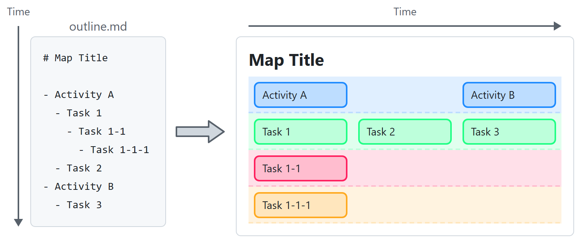
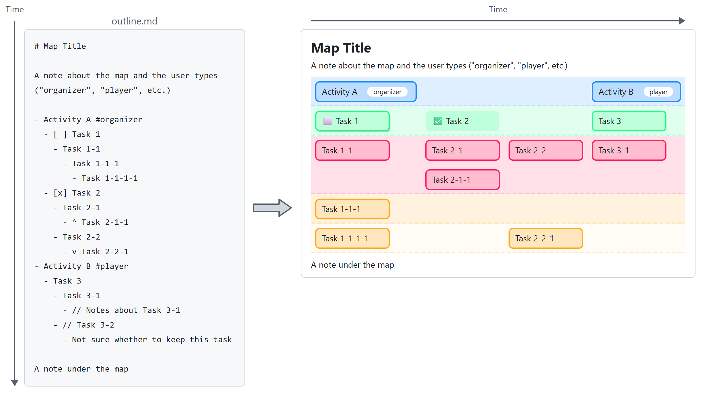
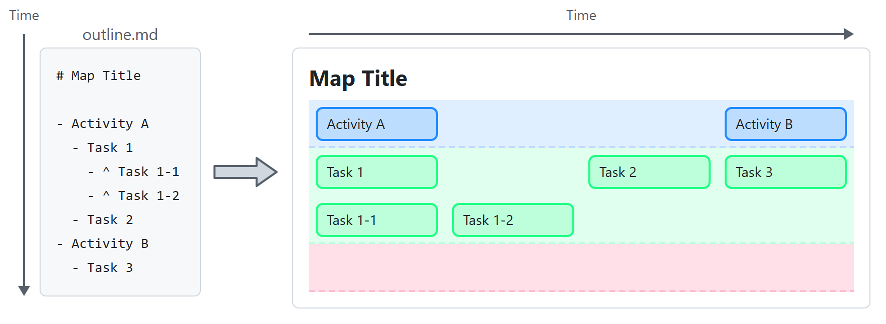
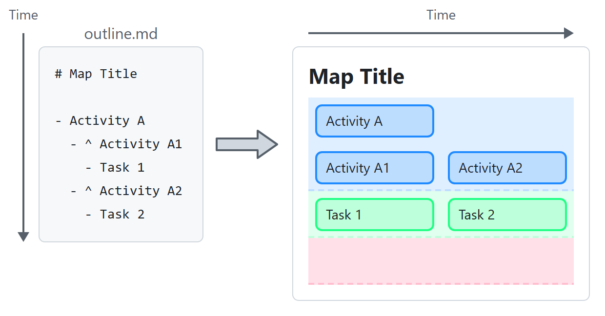
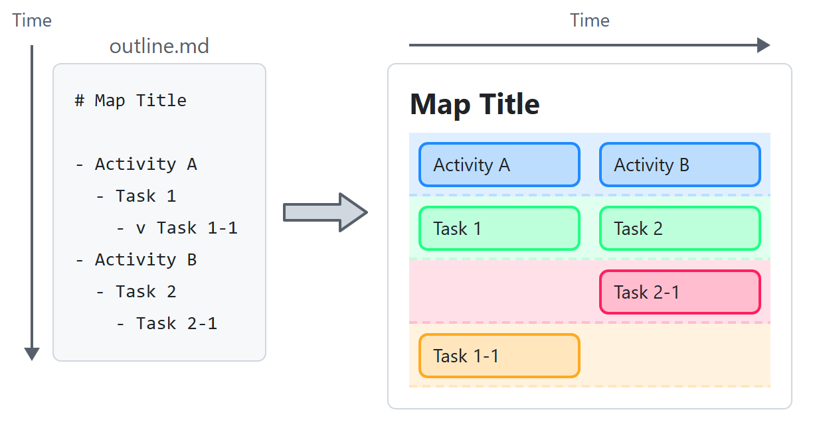
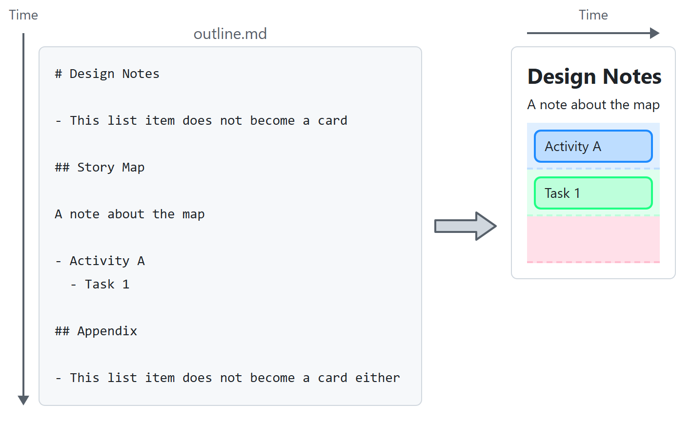

# Story Mapping Extension for VSCode

Japanese version: [README.ja.md](README.ja.md)

This VSCode extension lets you practice Story Mapping with a Markdown bullet list.

[Story Mapping](https://jpattonassociates.com/story-mapping/) is an agile practice by Jeff Patton. It helps the whole team picture how users will use the product. Stories are arranged from left to right along the flow of the user's activities, with the stories needed most at the top. The map makes it easier to see the whole picture of the stories and to decide what to build first.

Story Mapping is originally a team practice. The team gathers around sticky notes or cards, talks, and builds a shared understanding. However, I believe that it also helps when one person works on it alone with a digital tool. This extension lets you practice Story Mapping with nothing but a Markdown bullet list. The outline you write as a bullet list can be previewed as a story map as it is.

You can use this tool on your own to think more deeply about a product. It may also suit keeping a story map that a team made with sticky notes as a snapshot that you can edit digitally.

## How to Use

1. Open the Markdown file (.md) you want to turn into a story map.
2. Write a bullet list following "Outline Format" below.
   - Write the story of how users use the product as big steps, one bullet each.
     - Write each step as an action, such as "Sign up" or "Search for a product".
   - Then, under each step, add its details with deeper indentation.
   - For the details of the method, see [Jeff Patton's article](https://jpattonassociates.com/the-new-backlog/) or the book [User Story Mapping](https://www.oreilly.com/library/view/user-story-mapping/9781491904893/).
   - In a team, Story Mapping splits big stories into small ones through conversation. On your own, dig into the bullet list by asking yourself questions.
3. Open the preview in either of these two ways.
   - Click the map icon "Preview as Story Map" at the top right of the editor.
   - Right-click inside the editor and choose "Preview as Story Map" from the menu.
4. The map appears beside the editor.

### Outline Format

There are two basic ideas.

- **Time order**: items at the same indent level are placed from left to right on the map.
  - In Story Mapping, time flows from left to right on the map.
  - Items at the same indent level in the Markdown list appear on the map from left to right, in the order you write them.
- **Necessity**: items at deeper indent levels are added lower on the map.
  - In Story Mapping, the tasks that belong to a big user activity (User Activity) are placed below it. The more necessary a task is, the higher it goes.
  - In the Markdown list, items with no indent are treated as User Activities. Items added under them with indentation are placed on the map as Tasks one level lower.
  - The row right under a User Activity holds Tasks. The tasks one row lower are classified as the tasks to start first. In Story Mapping, this row is sometimes called the Walking Skeleton.

For example, the outline on the left renders as the map on the right:



### Syntax Reference

The table below refers to this example:



| You write | The map shows |
| --- | --- |
| The first heading (`#` to `######`) | The map title at the top. If there is no heading, the title area is empty |
| Paragraphs above the first bullet list | Notes under the title. Use them for remarks about the map or descriptions of the users who appear in it |
| Paragraphs below the bullet list | Notes under the map. You can write more than one. Use them for remarks about the whole map or for open questions. With a "Story Map" heading, paragraphs after the next heading are not included |
| A top-level `-` item | An activity. Activities appear in one row on the first level (blue) |
| A `-` item nested one level | A task. It appears on the second level (green) |
| A `-` item nested two levels | A task to start first. It appears on the third level (red) |
| A `-` item nested three or more levels | A lower task. It appears on the fourth level or below (yellow). Each extra level of nesting is one level lower |
| An ordered list starting with `1.` | Level titles. The items appear from the top at the left end of each level. Without an ordered list there is no title column. Write it once the map has taken shape, for example `1. Backbone` `2. Walking Skeleton` `3. Next Goal` |
| Two or more `-` items at the same depth | The second and later items move to the next inner column on the right (Task 2 in the example) |
| An item starting with `^ ` | Moves up. It does not go one slice lower. It stays on the slice of its parent, on the row below the parent (Task 2-1-1 in the example stays on the red slice with Task 2-1). The `^` is not shown on the card |
| An item starting with `v ` | Leaves a gap above. Each `v` skips one slice below the parent (Task 2-2-1 in the example skips the red slice and lands on the yellow one). `vv ` skips two slices. The `v` is not shown on the card |
| An item starting with `//` | A memo. Use it for the background of a card or your thoughts about it. The item and its children are left out of the map completely, and they do not change the number of columns or rows. A space after `//` is optional |
| An item starting with `[ ]` | An open task. The card shows ⬜ and has a drop shadow |
| An item starting with `[x]` or `[X]` | A completed task. The card shows ✅ and has no border and no shadow |
| An item with no checkbox | A card with a border only |
| `#tag` at the end of a line (one or more) | Shown at the end of the card as white rounded tags. Mainly used on activities to show which user does the activity (Activity A in the example is for "admin", Activity B for "member"). Tasks can have tags too. The `#` is not shown. |

Notes on indentation:

- You can indent with tabs or spaces. Indentation follows Markdown (CommonMark) rules; one tab equals four spaces.
- We recommend using one indent style within a single file.

The next two sections show, with figures, the two markers that move a task up or down the slices: `^` and `v`.

#### Moving a Task Up with `^`

Normally, each level of nesting moves a task one slice lower. An item that starts with `^ ` does not go lower. It stays on the slice of its parent, on the row below the parent inside that slice. Use it when a task has the same priority as its parent but you want to write it under the parent.



Task 1-1 and Task 1-2 are on the green slice, on the row under Task 1. The slice grows to two rows for every column, so Task 3 under Activity B stays on the first row of the slice.

The same rule works for activities. Children of an activity that start with `^ ` are sub-activities on the blue slice, each with its own column:



#### Moving a Task Down with `v`

An item that starts with `v ` goes two slices below its parent instead of one. The number of `v` is the number of slices to skip. `vv ` skips two slices, so the item goes three slices below its parent. Use it to push a task that can wait down to a lower slice.



Task 1-1 skips the red slice and lands on the yellow one. The skipped red slice is still drawn.

Rules for writing `^` and `v`:

- Put one space right after the marker. Without the space, as in `^Task` or `vsCode`, it is not a marker but normal text.
- Write the marker after the checkbox: `- [ ] ^ Task`.
- Use only one `^`. `^^` is not a marker.

#### Writing the Story Map inside a Normal Markdown Document

This is an advanced use. When the document has a heading whose text is `Story Map`, only the part from that heading to the next heading is the story map. List items above the heading, and list items after the next heading, do not become cards. Use this when the story map is one part of a design note or a meeting note.

- The heading level does not matter. Both `## Story Map` and `### Story Map` work.
- The heading text must be `Story Map` and nothing else. Case does not matter (`story map` and `STORY MAP` also match). A heading with other words, such as `My Story Map`, does not match.
- The map title is the first heading of the document, not the `Story Map` heading. The PNG file name uses the same title.
- The note paragraphs and the ordered list for level titles are taken only from the part after the `Story Map` heading.
- Without a `Story Map` heading, the whole document is the story map, as before.



## Recommended Setup

For comfortable outline editing, we recommend the following.

- The VSCode extension "[Dynalist-Style Moves](https://marketplace.visualstudio.com/items?itemName=OneOffObject.dynalist-mover-vscode)"
  - Lets you move items up and down as whole trees.
- The VSCode extension "[Markdown All in One](https://marketplace.visualstudio.com/items?itemName=yzhang.markdown-all-in-one)"
  - General Markdown conveniences.
- The VSCode extension "[markdownlint](https://marketplace.visualstudio.com/items?itemName=DavidAnson.vscode-markdownlint)"
  - A syntax checker for Markdown.
- Then change your key bindings to your favorite outliner style (swap items, change indent, and so on).

## Requirements

- VSCode for desktop (Windows/macOS/Linux).
- vscode.dev (the web version) is not supported.

## Install

Search for "Story Mapping" in the Extensions view of VSCode and install it from the VSCode Marketplace.

You can also download the `.vsix` file from the GitHub releases page and install it by hand.

## Development

```powershell
npm install
```

- **Run**: Open this folder in VSCode and press F5 to start the Extension Development Host.
- **Watch build**: `npm run watch`
- **Test**: `npm test` (Mocha + `@vscode/test-cli`; a test instance of VSCode will start)
- **Packaging**: `npm run package` creates a production build.

### Documents

- `docs/storymap.md` — the story map of this product itself (a temporary format until the extension is complete)
- `docs/adr/` — Architecture Decision Records
- `docs/plans.md` — the working todo list for the current TDD session
- `test/test.md` — a test map for manual checks
